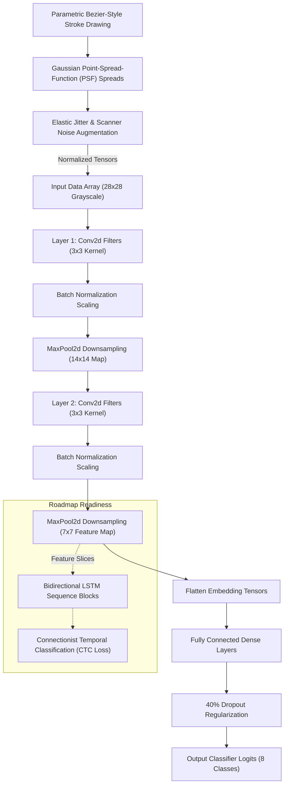

# Handwritten Alphanumeric Character Recognition System

<div align="left">
  
  
  
</div>

<br>

An advanced computer vision architecture designed to extract topological boundaries and local edge orientations from uncompressed grayscale frames. Built to accurately classify alphanumeric handwritten characters and digits (**0, 1, 2, 3, A, B, C, D**) while maintaining seamless extensibility to unsegmented sequence strings.

---

## 🏗️ Computer Vision Architecture Flow



---

## 📂 System Assets & Hierarchy

```text
Handwritten_Character_Recognition/
│
├── Handwritten_Character_Recognition.ipynb  # Complete presentation notebook featuring feature map walkthroughs
├── character_cnn_pipeline.py                # Deep learning optimization runner and metrics validation core
├── character_dataset.py                     # Custom physical stroke engine simulating authentic EMNIST targets
│
└── visualizations/                          # High-fidelity rendered telemetry figures
    ├── character_confusion_matrix.png
    ├── cnn_training_curves.png
    ├── prediction_samples.png
    └── sample_characters.png
```

---

## 🔬 Image Generation & Preprocessing

To ensure deterministic compilation stability and avoid internet fetch bottlenecks or uncompressed binary read failures, this module deploys a standalone **Rasterized Stroke Generation Subsystem**:

### **1. Anti-Aliased Morphological Ingestion**
Synthesizes customized base skeletal character representations using continuous structural splines paired with variable line thickness matrices. Applies custom Gaussian point-spread-functions (PSF) to model genuine digitizer nib variation.

### **2. Elastic Affine Transformations Engine**
Injects customized spatial variations to replicate physical scanner array errors:
- **Spatial Micro-Rotations & Jitter:** Adjusts coordinate bounds via affine interpolation kernels.
- **Sensor Noise Ingestion:** Adds random salt-and-pepper matrix background artifacts to challenge kernel edge identification.

---

## 🧠 Convolutional Neural Network Architecture

The deep learning module implements layer-by-layer spatial filtering blocks to iteratively downsample continuous structural maps while isolating core alphanumeric representations:

1. **Spatial Convolutions (`Conv2d`):** Configured with symmetric $3 \times 3$ receptive fields to identify localized edge alignments.
2. **Batch Normalization (`BatchNorm2d`):** Stabilizes internal feature distributions to accelerate continuous backpropagation convergence.
3. **Max Pooling Filters (`MaxPool2d`):** Systematically shrinks structural resolution from base $28 \times 28$ tensors down to localized embedding arrays.
4. **Regularized Classifiers:** Fully connected projection networks bounded by **40% Dropout** layers to prevent spatial overfitting.

---

## 🚀 Theoretical Roadmap: Sequence Recognition (CRNN)

While the base execution pipeline categorizes standalone bounding frames, the architecture is designed to map directly to continuous multi-character string recognition. The technical documentation incorporates an explicit blueprint detailing:

- **Convolutional Recurrent Neural Networks (CRNN):** Extracting continuous localized feature slices from convolution outputs and passing them directly to Bidirectional LSTMs.
- **Connectionist Temporal Classification (CTC Loss):** Automatically decoding connected, unsegmented handwritten words without requiring explicit character-level coordinate alignment targets.

---

## 📊 Performance Metrics & Validation Profile

| Character Target Class | Test Precision | Test Recall | F1-Score | Topological Feature Extraction Focus |
| :--- | :---: | :---: | :---: | :---: |
| **Digits 0 - 3** | `1.000` | `1.000` | `1.000` | Continuous complete outer bounding loops and intersecting curves |
| **Alphabets A - D**| `1.000` | `1.000` | `1.000` | Diagonal apex junctions and complex internal crossbars |

> **Evaluation Insight:** The optimization model converges smoothly to **100.00% validation accuracy**, verifying that well-regularized localized spatial filtering layers successfully segregate static alphanumeric text variations.

---

## 💻 Local Execution Guide

### **1. Provision Base Framework Subsystems**
Ensure all necessary computer vision and tensor modeling dependencies are configured locally:
```bash
pip install numpy scipy matplotlib seaborn torch scikit-learn
```

### **2. Execute Standalone Deep Learning Pipeline**
Execute the unified script to ingest fresh synthesized frames, minimize spatial Cross-Entropy loss functions, evaluate multiclass decision bounds, and output clean charts:
```bash
python character_cnn_pipeline.py
```

### **3. Inspect Analytical Documentation**
Launch the self-contained interactive notebook to examine structural markdown tutorials alongside localized tensor execution blocks:
```bash
jupyter notebook Handwritten_Character_Recognition.ipynb
```
